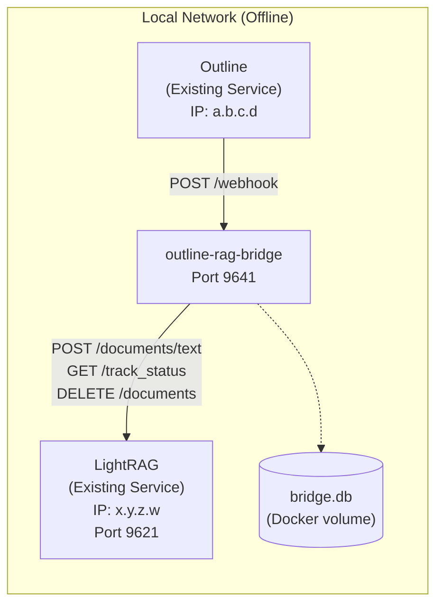
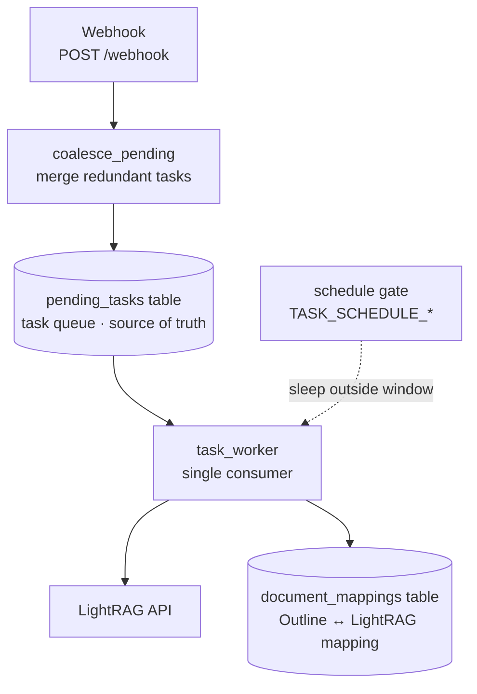

# OutlineRAGBridge — Offline Docker Deployment

[](README.md) [](README.en.md)

A bridge service that syncs Outline document changes to LightRAG in real-time via Webhook.
This guide is intended for **fully offline LAN environments**.

---

## Architecture



**Core Endpoints:**
- **Inbound** (for Outline Webhook): Container port `9641`, HTTP `POST /webhook`
- **Outbound** (to LightRAG): Configured via env var `LIGHTRAG_API_URL`
- **Health Check**: `GET /health`
- **Mapping Query**: `GET /mappings`
- **Queue Status**: `GET /queue` (pending task count + scheduling window state)

> **Scheduled nightly batch**: For limited compute, set `TASK_SCHEDULE_ENABLED=true`.
> Tasks are then processed only inside the daily window starting at
> `TASK_SCHEDULE_START` for `TASK_SCHEDULE_DURATION_MINUTES` minutes;
> during the day they are queued but not processed. The queue automatically
> coalesces multiple edits of the same document (keeping only the latest state),
> and delete events for documents never synced to LightRAG are dropped outright.

---

## Internal Architecture & Workflow



**DB-driven task queue**:
- On webhook, tasks are merged per document and written to the `pending_tasks` table (at most one row per document), then the worker is woken.
- A single worker consumer processes serially: take the oldest row → process → delete it.
- Benefits: no memory usage outside the window; unfinished tasks are automatically resumed after a crash/restart.

**Per-document coalescing rules** (executed in real time on enqueue):
| Pending task | New event | Result |
|---|---|---|
| CREATE / UPDATE | CREATE / UPDATE | Latest content wins; synced → UPDATE (delete old + insert new), unsynced → CREATE |
| CREATE / UPDATE | DELETE | Synced → keep only DELETE; never synced → drop all |
| DELETE | CREATE / UPDATE | Convert to UPDATE, keep latest content |
| DELETE | DELETE | Keep a single DELETE |

**Scheduling window**:
- Fixed-duration window: processing stops when the window ends; unfinished tasks accumulate to the next window.
- Supports crossing midnight (e.g. starts `23:00`, `240` min → ends `03:00` next day).
- Outside the window tasks are only enqueued, not processed (persisted in DB, no memory usage).

**Crash recovery & retries**:
- On startup, `recover_pending_tasks()` coalesces stale historical rows; the remaining tasks are processed automatically by the worker.
- Failed tasks are retried (default 3 times), then dropped with a log entry.

---

## Prerequisites

| Condition | Description |
|---|---|
| **Linux Server** | x86_64 architecture, Docker installed |
| **Docker Version** | ≥ 20.10 |
| **Existing Services** | Outline and LightRAG must already be running on the LAN |
| **Offline Image** | `outline-rag-bridge-v1.1.0.tar.gz` (pre-built, ~58MB) |

---

## Step 1: Import the Image

```bash
# Run in the directory containing the tar.gz file
docker load < outline-rag-bridge-v1.1.0.tar.gz

# Verify the image was imported
docker images outline-rag-bridge
# Example output:
# REPOSITORY               TAG       IMAGE ID       SIZE
# outline-rag-bridge       v1.1.0    246e7e4f0301   253MB
```

---

## Step 2: Configure Environment Variables

Before starting the container, you need two pieces of information:

1. **LightRAG server IP and port** (e.g. `192.168.1.10:9621`)
2. **A Webhook secret** (generate a random string, e.g. `my-strong-secret-2024`)

| Variable | Required | Description | Example |
|---|---|---|---|
| `LIGHTRAG_API_URL` | **Yes** | LightRAG service IP:Port | `http://192.168.1.10:9621` |
| `OUTLINE_WEBHOOK_SECRET` | **Yes** | Webhook HMAC key, must match Outline settings | `my-strong-secret-2024` |

> **Note**:
> - If LightRAG and bridge run on the same machine, `http://host.docker.internal:9621` may not work on Linux. Use the host's LAN IP instead.
> - If LightRAG is on a different server, ensure port 9641 on the bridge server is reachable on the LAN (check firewall rules).

---

## Step 3: Start the Container

### Option A: docker run (Recommended)

```bash
# Replace the values below with your actual configuration
docker run -d \
  --name outline-rag-bridge \
  --restart unless-stopped \
  -p 9641:9641 \
  -e LIGHTRAG_API_URL="http://192.168.1.10:9621" \
  -e OUTLINE_WEBHOOK_SECRET="my-strong-secret-2024" \
  -e TZ="Asia/Shanghai" \
  -e TASK_SCHEDULE_ENABLED="true" \
  -e TASK_SCHEDULE_START="00:00" \
  -e TASK_SCHEDULE_DURATION_MINUTES="480" \
  -v bridge-data:/app/data \
  outline-rag-bridge:v1.1.0
```

Parameters:
- `-d`: Run in background
- `--restart unless-stopped`: Auto-restart on crash or server reboot
- `-p 9641:9641`: Map host port 9641 to container port 9641
- `-e`: Set environment variables (see table above)
- `-e TZ`: **Timezone mapping**. The scheduling window is computed using the container's local time, so it must match your server's timezone (e.g. `Asia/Shanghai`), otherwise the scheduled time will be off.
- `-e TASK_SCHEDULE_ENABLED/START/DURATION_MINUTES`: Optional nightly batch window. Remove these 3 lines if you don't need batching (default is real-time processing); set `TASK_SCHEDULE_ENABLED` to `true` to enable it.
- `-v bridge-data:/app/data`: Persist SQLite database (mapping records)

### Option B: docker-compose

Create `docker-compose.yml`:

```yaml
services:
  outline-rag-bridge:
    image: outline-rag-bridge:v1.1.0
    container_name: outline-rag-bridge
    restart: unless-stopped
    ports:
      - "9641:9641"
    environment:
      - LIGHTRAG_API_URL=http://192.168.1.10:9621
      - OUTLINE_WEBHOOK_SECRET=my-strong-secret-2024
      - TZ=Asia/Shanghai
      - TASK_SCHEDULE_ENABLED=true
      - TASK_SCHEDULE_START=00:00
      - TASK_SCHEDULE_DURATION_MINUTES=480
      - DB_PATH=/app/data/bridge.db
    volumes:
      - bridge-data:/app/data

volumes:
  bridge-data:
```

Start:
```bash
docker compose up -d
```

---

## Step 4: Configure Outline Webhook

1. Log in to the Outline admin panel → **Settings** → **Integrations** → **Webhook**
2. Click **Create Webhook** and fill in:
   - **Name**: `bridge-sync` (customizable)
   - **URL**: `http://<bridge-server-IP>:9641/webhook`
     - Bridge and Outline on the same machine: `http://localhost:9641/webhook`
     - Bridge and Outline on different machines: `http://<bridge-server-LAN-IP>:9641/webhook`
   - **Secret**: Enter the same value as `OUTLINE_WEBHOOK_SECRET` (e.g., `my-strong-secret-2024`)
   - **Events**: Select `documents.create`, `documents.update`, `documents.delete`
3. Click **Save**

> **Note**: If Outline runs in Docker (common), it blocks webhooks to private IPs by default. Add this environment variable to Outline's `docker-compose.yml` and restart:
> ```yaml
> environment:
>   - ALLOWED_PRIVATE_IP_ADDRESSES=172.22.0.1,172.17.0.1,192.168.0.0/16
> ```

---

## Step 5: Verify Deployment

```bash
# 1. Check container status and health
docker ps --filter name=outline-rag-bridge
docker inspect --format='{{json .State.Health.Status}}' outline-rag-bridge
# Expected output: "healthy"

# 2. Test health endpoint
curl http://localhost:9641/health
# Expected output:
# {"status":"ok","lightrag_api":"http://192.168.1.10:9621","timestamp":"..."}

# 3. Check initial mappings (should be empty)
curl http://localhost:9641/mappings
# Expected output: {"mappings":[]}

# 4. Confirm non-root user
docker exec outline-rag-bridge whoami
# Expected output: appuser

# 5. Test LightRAG connectivity
docker exec outline-rag-bridge curl -sf http://192.168.1.10:9621/health

# 6. View container logs
docker logs outline-rag-bridge
```

---

## End-to-End Test

Create a document in Outline and verify the Webhook → Bridge → LightRAG pipeline:

```bash
# 1. Watch the bridge logs
docker logs -f outline-rag-bridge &

# 2. Create a document via Outline API (replace TOKEN with your Outline API Key)
curl -s -X POST http://localhost:8080/api/documents.create \
  -H "Content-Type: application/json" \
  -H "Authorization: Bearer ol_api_YOUR_API_KEY" \
  -d '{
    "title": "Test Document",
    "text": "# Test Document\n\nThis is a test to verify sync to LightRAG.",
    "collectionId": "YOUR_COLLECTION_ID",
    "publish": true
  }'

# 3. Expected log output:
#    Received Webhook: event=documents.create doc_id=xxx title=Test Document
#    Processing document create: outline_doc_id=xxx title=Test Document
#    Text inserted into LightRAG, track_id=insert_xxx

# 4. Verify document in LightRAG
curl http://localhost:9621/documents | python3 -m json.tool
```

---

## All Configuration Options

| Variable | Default | Required | Description |
|---|---|---|---|
| `LIGHTRAG_API_URL` | `http://lightrag:9621` | **Yes** | LightRAG API base URL |
| `OUTLINE_WEBHOOK_SECRET` | `""` | **Yes** | Webhook HMAC-SHA256 secret, must match Outline |
| `DB_PATH` | `/app/data/bridge.db` | No | SQLite database path (should be inside a volume) |
| `BRIDGE_PORT` | `9641` | No | Container internal listen port |
| `POLL_INTERVAL` | `2` | No | LightRAG async processing poll interval (seconds) |
| `POLL_MAX_ATTEMPTS` | `60` | No | Max poll attempts (default waits up to 120s) |
| `DELETE_RETRY_ATTEMPTS` | `2` | No | Max retries for document deletion |
| `DELETE_RETRY_DELAY` | `3` | No | Delay between delete retries (seconds) |
| `TASK_SCHEDULE_ENABLED` | `false` | No | Enable scheduled nightly batch. When `true`, tasks are only processed inside the daily window; during the day they are queued but not processed |
| `TASK_SCHEDULE_START` | `00:00` | No | Daily processing window start time (`HH:MM`, server local time) |
| `TASK_SCHEDULE_DURATION_MINUTES` | `480` | No | Processing window length (minutes); processing stops when the window ends |
| `LOG_LEVEL` | `INFO` | No | Log level: `DEBUG`/`INFO`/`WARNING`/`ERROR` |

---

## Common Operations

### Stop the container
```bash
docker stop outline-rag-bridge
```

### Start a stopped container
```bash
docker start outline-rag-bridge
```

### View live logs
```bash
docker logs -f outline-rag-bridge
```

### Update the container (keep data)
```bash
docker stop outline-rag-bridge
docker rm outline-rag-bridge
# Load the new version image...
docker load < new-version-image.tar.gz
# Start with the same -v bridge-data:/app/data to retain data
docker run -d --name outline-rag-bridge ... -v bridge-data:/app/data ... outline-rag-bridge:v1.1.0
```

### Backup data
```bash
# bridge.db is stored in a Docker volume
# Find the volume location
docker volume inspect bridge-data
# Backup
tar czf bridge-backup-$(date +%Y%m%d).tar.gz /var/lib/docker/volumes/bridge-data/_data/
```

---

## Troubleshooting

| Problem | Cause | Solution |
|---|---|---|
| Container status `unhealthy` | LightRAG unreachable or starting up | Check `LIGHTRAG_API_URL` |
| Outline not sending Webhook | Outline container blocks private IPs | Add `ALLOWED_PRIVATE_IP_ADDRESSES` to Outline env |
| Webhook returns 401 | Secret mismatch | Check `OUTLINE_WEBHOOK_SECRET` matches Outline settings |
| Container exits immediately | Port conflict or config error | Check `docker logs outline-rag-bridge` for details |
| No log output after document create | Webhook URL misconfigured | Check the Webhook URL IP and port in Outline settings |
